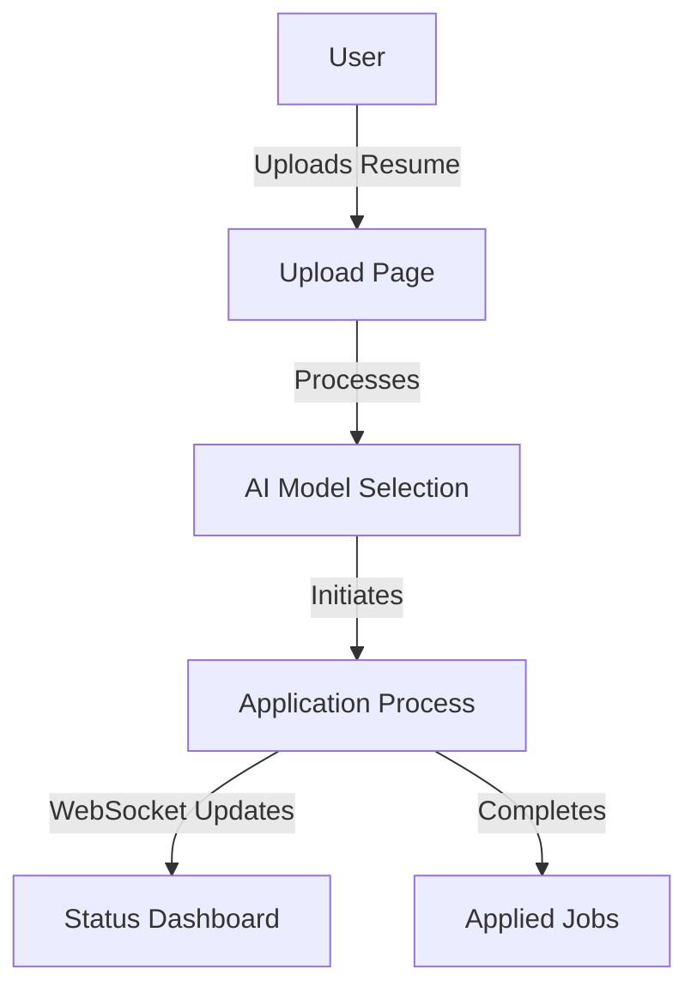

# Quill - Automated Job Application System

Quill is an intelligent job application automation system that streamlines the process of applying to multiple job positions. It uses AI to fill out job applications automatically while providing real-time status updates through a modern web interface.

## Demo Video

Watch our demo to see Quill in action:

[](https://www.youtube.com/watch?v=VCf5094ZVx8 "Watch the Quill Demo")

## Contributors

- Dominic [@reb0und](https://rebound.sh/) - Backend Developer, Freshman at Stevens
- Saaim [@saaimk1](https://github.com/saaimk1) - Frontend Developer & Data Engineer, Junior at Rutgers
- Sameel [@sameelarif](https://www.sameel.dev) - Software Developer, Junior at Rutgers

## How It Works

### Architecture Overview



### Core Components

#### 1. Resume Upload

- Users begin by uploading their resume in PDF, DOC, or DOCX format
- The system processes and extracts relevant information from the resume
- Maximum file size: 10MB

#### 2. Model Selection

- Users can choose different AI models optimized for various job types:
  - General Applications
  - Technical Positions
  - Creative Roles
  - etc.

#### 3. Real-Time Status Tracking

The application uses WebSocket connections to provide real-time updates on the application process. Status types include:

| Status           | Description                         |
| ---------------- | ----------------------------------- |
| Initializing     | Starting the application process    |
| Filling Out Form | AI is completing application fields |
| Uploading Resume | Submitting documents                |
| Completed        | Application successfully submitted  |

#### 4. WebSocket Communication Protocol

The system uses a WebSocket server at port 8080 that handles three types of events:

```typescript
// New job listing being processed
{
  type: "job_listing",
  data: {
    company: string,
    jobTitle: string,
    url: string,
    location: string,
    status: string
  }
}

// Status update for existing application
{
  type: "status",
  data: {
    company: string,
    jobTitle: string,
    url: string,
    location: string,
    status: string
  }
}

// Application completion notification
{
  type: "finished",
  data: {
    company: string,
    jobTitle: string,
    url: string,
    location: string,
    status: string
  }
}
```

### User Interface

The application features a modern, responsive interface with:

- Dark theme optimized for reduced eye strain
- Real-time status updates with color-coded indicators
- Compact URL display showing only domain names
- Mobile-responsive tables with horizontal scrolling
- Progress tracking for each application stage

### Backend Implementation

The backend service that handles resume processing, AI-powered form filling, and WebSocket communication can be found at [github.com/quill-co/quill-backend](https://github.com/quill-co/quill-backend). This service is responsible for:

- Processing uploaded resumes
- Running AI models for form completion
- Managing WebSocket connections
- Handling the job application automation
- Providing real-time status updates

### Technical Stack

- **Frontend**: Next.js with TypeScript
- **UI Components**: Custom components with Tailwind CSS
- **Real-time Updates**: WebSocket protocol
- **State Management**: React hooks (useState, useEffect)
- **Routing**: Next.js App Router
- **Styling**: Tailwind CSS with custom gradients and animations

## Getting Started

First, run the development server:

```bash
npm run dev
# or
yarn dev
# or
pnpm dev
# or
bun dev
```

Open [http://localhost:3000](http://localhost:3000) with your browser to see the result.

You can start editing the page by modifying `app/page.tsx`. The page auto-updates as you edit the file.

This project uses [`next/font`](https://nextjs.org/docs/app/building-your-application/optimizing/fonts) to automatically optimize and load [Geist](https://vercel.com/font), a new font family for Vercel.

## Learn More

To learn more about Next.js, take a look at the following resources:

- [Next.js Documentation](https://nextjs.org/docs) - learn about Next.js features and API.
- [Learn Next.js](https://nextjs.org/learn) - an interactive Next.js tutorial.

You can check out [the Next.js GitHub repository](https://github.com/vercel/next.js) - your feedback and contributions are welcome!

## Deploy on Vercel

The easiest way to deploy your Next.js app is to use the [Vercel Platform](https://vercel.com/new?utm_medium=default-template&filter=next.js&utm_source=create-next-app&utm_campaign=create-next-app-readme) from the creators of Next.js.

Check out our [Next.js deployment documentation](https://nextjs.org/docs/app/building-your-application/deploying) for more details.
